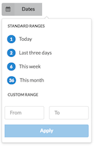
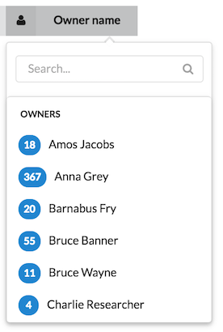
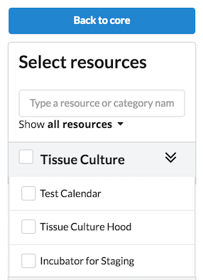

iLab uses many different types of filter controls and advanced search capabilities. In general, try to use one of the filter menus in the existing codebase.

#### Code
For secondary and tertiary navigation and filter panels, iLab uses [vertical menus](http://semantic-ui.com/collections/menu.html#vertical-menu).

#### Guidelines
- Place the menu or filter panel on the left hand side.
- Provide a way to clear search facets.
- Make the menu mobile friendly.
- If possible, provide a list of search facets being used (i.e., chips/tokens).
- Limit the number of options per facet so that the menu does not extend off the page on long lists.


#### Examples
Dropdown with text search and vertical facet with option search.


