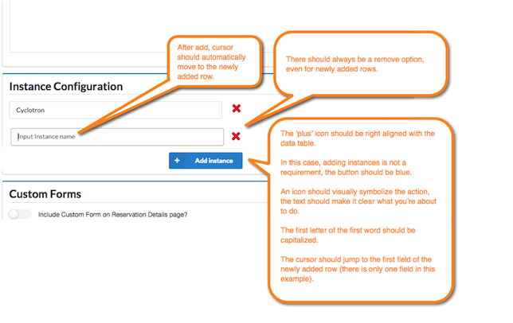

Inputs, specifically text, should direct the user as to what information should be entered.

#### Code

#### Guidelines
- [Size inputs](http://semantic-ui.com/collections/form.html#fields) to reflect the data that will be entered. For example, a phone number input should be 10 or 12 characters long.
- Make placeholder text the secondary label because it's often too low of contrast to ensure accessibility.
- Rows of inputs:
  - When adding a row of inputs, always place the cursor in the next row.
  - If removing the row only destroys or deletes a connection between two records, and is easily recovered, us a red "X" on the row.
  - If removing the row will destroy data that cannot be easily derived (e.g., name, date, PO number), use a trash can icon and display an alert warning.
  

